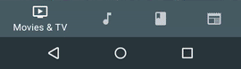
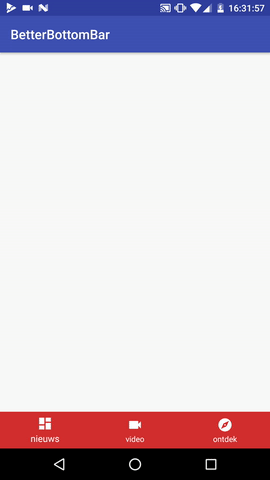
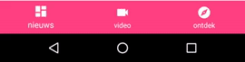
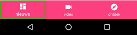

# Better BottomNavigationView

Trying to fix the biggest let down view in the Android design lib.  
_Everything_ wrong with [BottomNavigationView](https://developer.android.com/reference/android/support/design/widget/BottomNavigationView.html).  
This contains fixes for missing **save state**, **accessibility** and the **colorful transition** on tab change.

</img>

## Basic usage

The view is written in Kotlin, but you can safely use it in your trusty old Java project if you are willing to import the Kotlin Standard library.
See the [example](https://github.com/timrijckaert/BetterBottomBar/blob/master/app/src/main/kotlin/be/rijckaert/tim/betterbottombar/MainActivity.java).

Basic Sample Usage.  
Just like your regular `BottomNavigationView` you can inflate your custom menu.

```xml
<be.rijckaert.tim.library.BetterBottomBar
        android:layout_width="match_parent"
        android:layout_height="wrap_content"
        android:background="@color/colorAccent"
        android:layout_alignParentBottom="true"
        android:layout_gravity="bottom"
        app:itemIconTint="@color/white"
        app:itemTextColor="@color/white"
        app:menu="@menu/bottom_navigation_main"/>
```

### Text Colors And Icon Drawable

You can alter the text colors for each tab with the help of the `app:XXXXTabTextColors`.   
For example for the first tab you should use `app:firstTabTextColors`.  
just provide your custom `ColorStateList`

See the sample if you need more explanation

```xml
<selector xmlns:android="http://schemas.android.com/apk/res/android">
    <item
        android:color="@color/textColorPrimary"
        android:state_checked="true"/>
    <item
        android:color="@color/textColorPrimaryUnselected"
        android:state_checked="false"/>
</selector>
```

Same for the icon drawable just use the `app:XXXTabIconColors`

### Tab Change Listener

In order to receive tab change events you should attach a `betterBottomBarClickListener`.

```kotlin
betterBottomBar.betterBottomBarClickListener = { betterBottomBar, menuItem ->
    //get state
}
```

### Save State

</img>

On rotation all the correct color are still applied to your view.
You can also access the `selectedTab` index via code.

```java
final BetterBottomBar betterBottomBar = (BetterBottomBar) findViewById(R.id.bottom_navigation);
betterBottomBar.getSelectedTab();
```

### Color Animation

</img>

You can change the default colors with the `app:colors` attribute.  
Make sure to reference an `IntArray` of colors

When no color array has been added, no animation will happen.

```xml
<be.rijckaert.tim.library.BetterBottomBar
        android:layout_width="match_parent"
        android:layout_height="wrap_content"
        android:background="@color/colorAccent"
        android:layout_alignParentBottom="true"
        android:layout_gravity="bottom"
        app:itemIconTint="@color/white"
        app:itemTextColor="@color/white"
        app:colors="@array/bottom_bar_colors"
        app:menu="@menu/bottom_navigation_main"/>
```

>@array/bottom_bar_colors

```xml
<array name="bottom_bar_colors">
    <item>@color/colorPrimary</item>
    <item>@color/someReddishColor</item>
    <item>@color/blackAsYourHeart</item>
</array>
```

###Accessibility Support

</img>

You can add accessibility to your `BottomNavigationView` by adding the `app:contentDescriptionTitles` attribute whichs refs to a `StringArray`.  
If you forget to do this. The view will use reflection to look for your titles.  
Don't be a dick just provide them.

```xml
<be.rijckaert.tim.library.BetterBottomBar
        android:layout_width="match_parent"
        android:layout_height="wrap_content"
        android:background="@color/colorAccent"
        android:layout_alignParentBottom="true"
        android:layout_gravity="bottom"
        app:itemIconTint="@color/white"
        app:itemTextColor="@color/white"
        app:contentDescriptionTitles="@array/better_bottom_bar_accessibility_title"
        app:menu="@menu/bottom_navigation_main"/>
```

> string.xml

```xml
<array name="better_bottom_bar_accessibility_title">
    <item>@string/news_title</item>
    <item>@string/video_title</item>
    <item>@string/discover_title</item>
</array>
```

At the moment it only supports:
 * English
 * Dutch

Feel free to submit PR for more language support